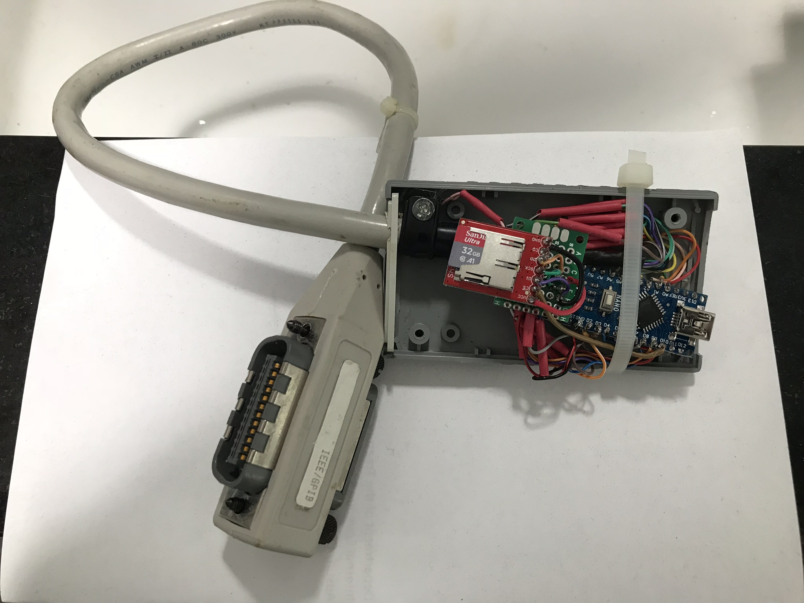

# Tektronix-4050-GPIB-Flash-Drive
Tape Drive emulator for Tektronix 4050 series (4051/4052/4054) computers using an SD (or microSD) card for storage.

The Tektronix 4050 series of computers was introduced in 1975 with the 4051 using a Motorola 6800 CPU with 32KB of BASIC in ROM and 32KB of DRAM.
These computers integrated a 12 inch direct view storage tube (DVST) for 1024x780 addressable vector graphics, keyboard, and a 3M DC300 tape drive for program storage.

----
Here is a link to my thread on vcfed.org for this project:
http://www.vcfed.org/forum/showthread.php?64018-Tektronix-405x-GPIB-Flash-Drive&p=518793#post518793
---
My first hardware version was based on Emanuele Girlando's Arduino GPIB sketch which can be found here:
http://egirland.blogspot.com/2014/03/arduino-uno-as-usb-to-gpib-controller.html

My first prototype of this hardware with an Arduino Nano with a microSD card and GPIB cable: 

I had to move some of the GPIB pins in Emanuele's layout to attach the microSD card to the SPI interface.

However, Emanuele's Arduino code only supports GPIB controller - and for my project I need the tape emulator to be a GPIB device, as the 4050 series computers must be the GPIB controller.

